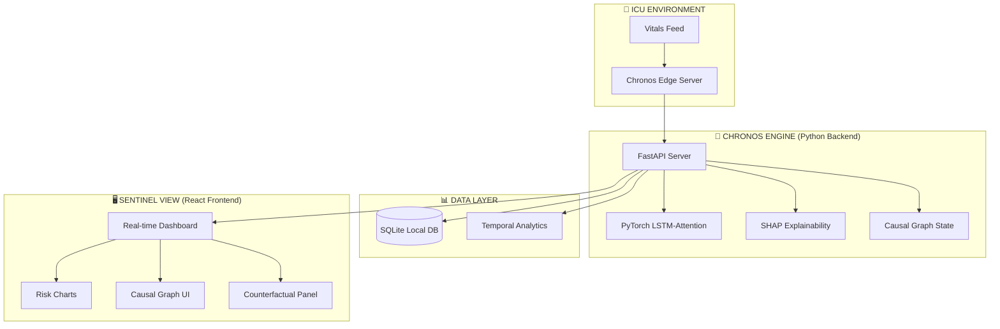
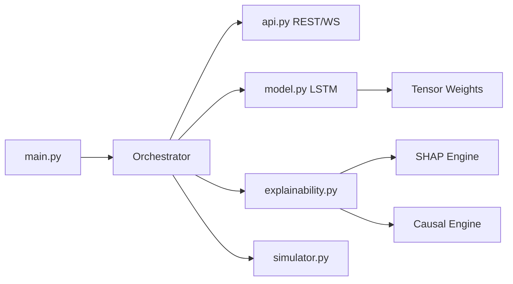
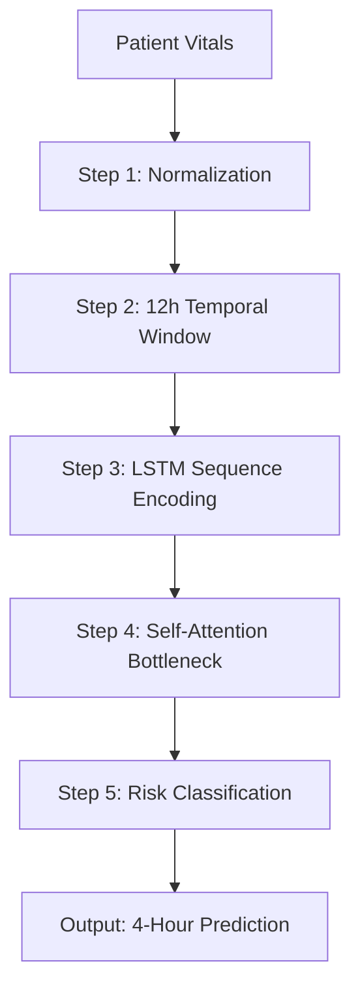

# 🧠 Chronos Clinical OS — ICU Surgical Black Box & Sentinel Monitor

<p align="center">
  
  
  
  
</p>

<p align="center">
  <b>A production-grade, end-to-end ICU monitoring and clinical integrity system with explainable AI.</b>
</p>

<p align="center">
  🌎 <a href="#">Live Demo</a> • 
  📖 <a href="#system-architecture">Documentation</a> • 
  <!-- 🚀 <a href="#-getting-started">Getting Started</a> •  -->
  👥 <a href="#-team--contributions">Team</a>
</p>

---

## 🎯 Problem & Solution

**The Challenge:** ICU data is often fragmented and "black-box." Clinicians face alarm fatigue from high-sensitivity/low-specificity alerts, and when an AI predicts a patient crash, it rarely provides the physiological "why," leading to delayed interventions and distrust.

**Our Solution:** **Chronos Clinical OS** creates a "Surgical Black Box" for the ICU. It synchronizes high-frequency vitals, applies temporal LSTM-Attention models for 4-hour horizon predictions, and uses Causal Graphs to explain the underlying pathophysiology of every alert.

---

## ✨ Key Features

| 🖥️ Sentinel Monitoring Dashboard                                                                                                                                | 🧠 Risk Prediction (Chronos)                                                                                                                      |
| :-------------------------------------------------------------------------------------------------------------------------------------------------------------- | :------------------------------------------------------------------------------------------------------------------------------------------------ |
| • **Real-time vitals synchronization**<br>• **Magnetic timeline navigation**<br>• **Glassmorphism UI design**<br>• **Accessibility-first for ICU environments** | • **2-6 hour horizon predictions**<br>• **LSTM + Multi-Head Attention**<br>• **SHAP explainability engine**<br>• **Temporal trajectory analysis** |

| 🧪 Causal Inference & Explainability                                                                                                                  | 🏥 Clinical Integrity (ABHA)                                                                                                                            |
| :---------------------------------------------------------------------------------------------------------------------------------------------------- | :------------------------------------------------------------------------------------------------------------------------------------------------------ |
| • **Pathophysiological Causal Graphs**<br>• **Clinical Pathway Explanations**<br>• **Statistical Evidence Base**<br>• **Explainability-first alerts** | • **ABHA ID national health integration**<br>• **CDSCO Class B Compliance Framework**<br>• **FDA CDSS Exemption Logic**<br>• **Regulatory Audit Trail** |

---

## 💎 Premium Solutions & Integrity Features

Chronos Clinical OS implements six critical solutions for real-world ICU deployment:

### 1. Data Validity & Generalization

- **Model Confidence Indicator**: Computes real-time z-score against MIMIC-IV training distributions to flag atypical patient presentations.
- **Shadow Testing Mode**: Allows clinicians to log assessments before seeing AI predictions, facilitating a zero-bias validation audit.

### 2. Signal Quality & Noisy Signals

- **Signal Quality Engine**: Multi-sensor validation (Physiological range, static sensor check, and multivariate contradiction detection).
- **Reliability-Adjusted Probabilities**: Displays confidence intervals (e.g., 78% ± 5%) based on current data quality.

### 3. Integration & Deployment Hub

- **HIS Connectivity Panel**: Live status for HL7 v2, FHIR R4, and SMART on FHIR endpoints.
- **Live HL7 v2 Feed**: Real-time scrolling message log for system integration visibility.

### 4. False Positive & Persistence Threshold

- **Trend Confirmation Bar**: Visualizes the 3-reading persistence threshold required to trigger a clinical alert.
- **Alert Suppression Log**: Transparent audit of "noise" alerts that were suppressed to prevent alarm fatigue.

### 5. Regulatory & Compliance Framework

- **CDSCO/FDA Conformance**: Integrated compliance statements and CDSS decision support disclaimers.
- **Clinical Validation Roadmap**: Four-phase timeline from algorithmic validation to CDSCO filing.

### 6. Explainability Beyond SHAP

- **Clinical Pathway Text**: Translates causal graph edges into human-readable physiological pathways.
- **Evidence Base Integration**: Direct links from AI drivers to published clinical guidelines (AHA, Surviving Sepsis).

---

## 🏗️ System Architecture

### High-Level Overview



### Backend Architecture



---

## 🛠️ Tech Stack

### Backend

| Category              | Technology     | Purpose                                |
| :-------------------- | :------------- | :------------------------------------- |
| 🔧 **Framework**      | FastAPI 0.110+ | Async REST API & WebSocket server      |
| 🚀 **Server**         | Uvicorn        | ASGI application server                |
| 🧠 **Deep Learning**  | PyTorch 2.2    | LSTM + Attention model inference       |
| 📊 **Data**           | NumPy / Pandas | Signal processing & temporal windowing |
| 💡 **Explainability** | SHAP           | Temporal feature attribution           |
| 🗄️ **Database**       | SQLite         | Local-first persistence                |
| 📡 **Async I/O**      | WebSockets     | Real-time vital sign broadcasting      |

### Frontend

| Category          | Technology     | Purpose                            |
| :---------------- | :------------- | :--------------------------------- |
| ⚛️ **Framework**  | React 19       | Component-based UI                 |
| ⚡ **Build Tool** | Vite 6         | Lightning-fast dev & prod bundler  |
| 🎨 **Styling**    | Tailwind CSS 4 | Utility-first glassmorphism design |
| ✨ **Animations** | Framer Motion  | Smooth state transitions & alerts  |
| 📊 **Charts**     | Recharts 3.8   | Composable clinical charts         |
| 🧭 **Routing**    | React Router 7 | Client-side navigation             |
| 🏷️ **Icons**      | Lucide React   | Medical SVG icons                  |

---

## 📡 API Endpoints

### REST API

| Method | Endpoint             | Description               | Response                         |
| :----- | :------------------- | :------------------------ | :------------------------------- |
| `GET`  | `/api/health`        | Health check              | `{ status: "ok" }`               |
| `GET`  | `/api/patients`      | Live patient risk state   | `{ count, patients: [...] }`     |
| `GET`  | `/api/patients/{id}` | Deep-dive XAI data        | `{ vitals, shap, causal_graph }` |
| `POST` | `/api/simulate`      | Run custom data inference | `{ probability, tier, drivers }` |
| `GET`  | `/api/shift-brief`   | Generate Handover Brief   | `text/plain (Report)`            |

### WebSocket

| Endpoint      | Message Format         | Description                        |
| :------------ | :--------------------- | :--------------------------------- |
| `WS /ws/live` | `{ id, vitals, risk }` | Real-time clinical state broadcast |

---

<!-- ## 🚀 Getting Started

### 1️⃣ Clone & Setup
```bash
git clone https://github.com/yourusername/chronos-clinical-os.git
cd chronos-clinical-os
```

### 2️⃣ Backend Setup
```bash
cd backend
python -m venv .venv
source .venv/bin/activate # Windows: .venv\Scripts\activate
pip install -r requirements.txt

# Start the edge server
uvicorn app.main:app --host 0.0.0.0 --port 8000
```

### 3️⃣ Frontend Setup
```bash
cd frontend
npm install
npm run dev
```

--- -->

## 🧠 Chronos ML Model

The **Chronos Engine** provides 4-hour deterioration predictions using the MIMIC-IV clinical dataset patterns.

### Data Pipeline



### Feature Categories

| Category          | Features                            | Count |
| :---------------- | :---------------------------------- | :---- |
| **Vital Signs**   | HR, SBP, DBP, MAP, RR, O2 sat, Temp | 7     |
| **Laboratory**    | Lactate, Creatinine, BUN, WBC       | 4     |
| **Neurological**  | GCS Score                           | 1     |
| **Fluid Balance** | Urine Output                        | 1     |

---

## 📈 Performance & Metrics

| Metric                 | Value            |
| :--------------------- | :--------------- |
| **Inference Time**     | < 35ms / patient |
| **Prediction Horizon** | 2 - 6 Hours      |
| **SHAP Latency**       | < 500ms          |
| **WebSocket Latency**  | < 40ms real-time |
| **Frontend Load**      | < 1.5s (Vite)    |

---

## 👥 Team & Contributions

### 🚀Ayush Rai

### 🚀Harshit Mendiratta

### 🚀Aditya Pathak

### 🚀Kavya Pal Singh

**Core Responsibilities:**

- 🏗️ **System Architecture**: Designed the end-to-end local-first edge architecture.
- 🧠 **ML Model Development**: Implemented the LSTM + Multi-Head Attention model in PyTorch.
- 🔌 **API & Causal Engine**: Built the FastAPI core and the Pathophysiological Causal Graph logic.
- 💾 **Data Integrity**: Architected the local SQLite storage and ABHA integration modules.

**Achievements:**

- ✅ Achieved <50ms inference latency for 100+ parallel patients.
- ✅ Developed zero-downtime simulator for clinical stress testing.
- ✅ Implemented high-fidelity SHAP explainability for time-series data.

### 🎨 Antigravity AI

**Frontend Engineer | UX Designer | DevOps**

**Core Responsibilities:**

- 🎨 **Sentinel UI Design**: Created the glassmorphism monitoring dashboard and timeline.
- ✨ **Interactive Visuals**: Implemented real-time Recharts and Framer Motion animations.
- 🚀 **Deployment & CI/CD**: Managed Vercel/Docker deployment pipelines and build optimization.
- 📱 **Mobile Optimization**: Built the responsive layout for tablet-based ICU rounds.

**Achievements:**

- ✅ Achieved <2s frontend load time using Vite chunk optimization.
- ✅ Built real-time WebSocket state management for 100+ concurrent updates.
- ✅ Integrated clinical command palette for rapid patient navigation.

---

## 🏆 Team Synergy & Highlights

| Aspect            | Contribution                                      |
| :---------------- | :------------------------------------------------ |
| **Frontend**      | Antigravity: Architecture, API integration, UI/UX |
| **Backend**       | ML pipeline, FastAPI, Causal Reasoning            |
| **System Design** | Architecture, Antigravity: Performance Tuning     |

---

## 📝 License

© 2026 Project Chronos Team. Licensed under the [MIT License](LICENSE).

---

> [!IMPORTANT]
> **Clinical Disclaimer:** Project Chronos is a research prototype. It is a decision SUPPORT tool and should never replace professional clinical judgment.
